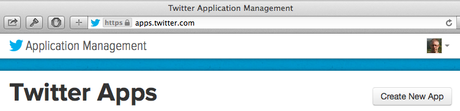
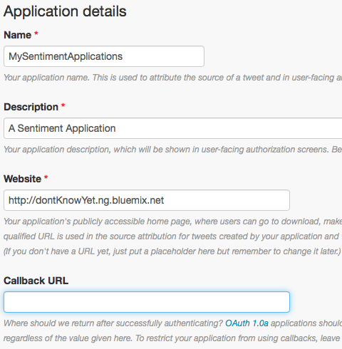
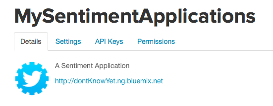

## Simple Sentiment Analysis application

Sample application demonstrating how to build a sentiment analysis app usind Node.js and a couple modules.  
The application takes a keyword or hashtag, connects to Twitter to get a stream of matching tweets, 
and runs those tweets through a sentiment-analysis module to produce a sentiment score.

You can play with an instance of the application running at http://simplesentimentanalysis.mybluemix.net/

You can explore the code by clicking into the SimpleSentimentAnalysis folder.

### Get your Twitter keys and plug them into the app

In order to run the sample, you'll need to paste in your own API keys from Twitter. 

* Go to https://dev.twitter.com/apps, create a new app, generate an API key and an access token.
* Edit the app.js file, replace the consumer_key and consumer_secret with your application key and secret.
* Replace the access_token_key and access_token_secret with your access token and access token secret from Twitter.

If you don't replace these, the app will fail to connect to Twitter, and should log an authentication error.

### Running the application on your desktop

Download the source of the application by selecting the SimpleSentimentAnalysis folder and selecting
"Export as zip" from the Actions menu() in the navigator.

Unzip the application in a working directory.

Use npm to get the required modules:

    npm install

Run the application with node:

    node app.js

You should see a confirmation that the application is running on port 3000, 
and you can access it with your browser at http://localhost:3000.

### Running the application using a Cloud Foundry PaaS runtime

If you have access to a Cloud Foundry-based runtime, like the Pivotal Cloud Foundry offering or IBM's BlueMix,
you can also run the application in those environments.

### To get your own Twitter Application Keys

To get your own Twitter application keys for this project or any others first go to the [Twitter Developer Page](https://apps.twitter.com/app) and click on __Create New App__

Then fill in the details for the app as follows.  Since you might not know your URL yet you can put in a placeholder.  Then Scroll down to _Yes I Agree_ disclaimer and press the __Create Your Twitter Application__.

In the Application Management page, choose the API Keys _tab_ to generate your own keys.

Originally you will have no application keys, just the API keys.  Press the __Create My Access Token__ button and accept the prompt that appears.  It might take a minute to do this so you might have to refresh the page.  Once complete there are the API keys at the top of the page and the Access Token keys at the bottom.

Use these in the __app.js__ section replacing the default values.

### Licensed under the EPL (see [license.txt](license.txt))

