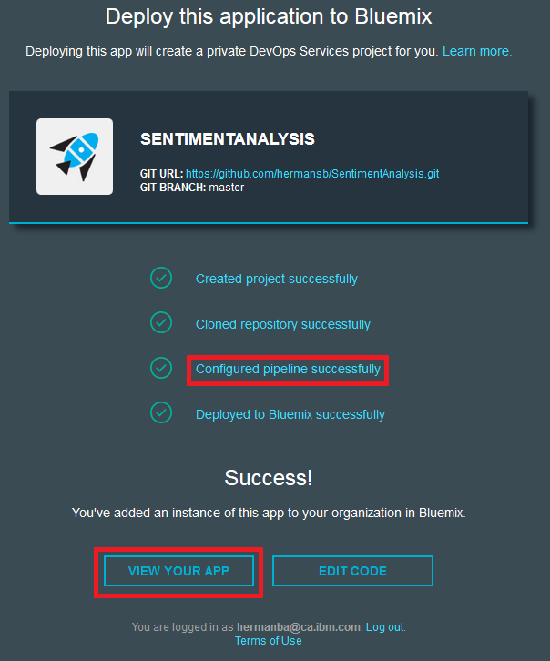

# Bluemix workshop: Simple Sentiment Analysis application

You can do lots of cool things when you develop apps on the cloud. We've created this short workshop to let you try working with an app on the cloud.

## Create your own version of the app

1. Deploy this application to Bluemix by clicking the **Deploy to Bluemix** button .

2. Log in to Bluemix using the credentials that we provided for your Bluemix account.

3. Click **DEPLOY** after the ORGANIZATION and SPACE finish loading. A project is created under your Bluemix account and the code is copied (cloned) to the project. A pipeline is configured for your code to travel through, and finally, that pipeline pushes the code to a running instance of the application on Bluemix.

4. Click **VIEW YOUR APP** to see a live, running version of your app!

5. Let's make sure that your Sentiment Analysis app is working. Type a topic to monitor, and then click **Go**.

 **Note**: You might have to wait a few minutes for the tweets to be analyzed.

## Customize your app

1. Now that you've checked that your Sentiment Analysis app is working, let's go back to the Deploy this application to Bluemix page to customize the app.

2.	in the upper-right corner of the window, click **EDIT CODE** and wait for the code editor to load in your browser.

3. In the file navigator, which is on the left side of the window, click **app.js** to open the file.

4. Change lines 150 and 169 to include your names inside the `<title>` and `</title>` tags. For example: `Helen and Colleen's Twitter Sentiment Analysis`.

5. From the Web IDE menu, which is on the left side of the window, click the Git  icon.

6. In the Working Directory Changes section, which is in the upper-right corner of the window, make sure that the `app.js` file is selected. Type a commit message that explains what you changed. For example, `Added names to title`. Click **Commit** and then click **Push**.

7.	In the upper-right corner of the window, click **BUILD & DEPLOY** to watch the pipeline deploy the change to your live Bluemix app.

8.	After the deployment completes, in the **LAST EXECUTION RESULT** section, click the URL for your app.

You should see your name in the title of the tab that opens.

Congratulations! You completed the workshop. Take a well-deserved break, continue making changes to the app, or read the appendices below for future development.

## Appendix I: Check the logs of your running application on Bluemix

1. You deployed your app to Bluemix using the Cloud Foundry runtime. To check your logs, [download the cloud foundry command-line interface](https://github.com/cloudfoundry/cli/releases).
2. After you install the command-line interface, open a Windows command prompt (for Windows) or Terminal (for Mac OS / Linux) and
run the following commands:
  - `cf login -a https://api.ng.bluemix.net -u <Bluemix UserId> -p <Bluemix Password>`
  - `cf apps` to get a list of apps in your organization and space
  - `cf logs --recent <appNameFromAboveList>` to view the recent logs for your app running on Bluemix

## Appendix II: Use your own Twitter keys

To make this workshop as easy as possible, we gave you Twitter keys as part of the source code. Twitter rate limits the calls that you can make to its service based on your API keys. Because several of your groups are using the same set of API keys for this workshop, this might cause the sentiment analysis to slow down.

If you have your own Twitter account with a verified phone number (by using a text message), you can enter your own Twitter keys into your running application. For instructions about using your own keys, skip to the "Get your Twitter keys and add them to your app" section.

**Note**: For security reasons, the API keys that we provided in the source code will be revoked after this workshop is complete.

Technical Note: To make sure that your code and Twitter account are secure, don't deliver your Twitter API keys in the code. Instead, set the Twitter API keys as environment variables so that anyone can see your code without compromising the security of your Twitter account and your app.

### Get your Twitter keys and add them to your app

To run the Sentiment Analysis sample, you need to add your own Twitter API keys.

1. Go to the <a href="https://apps.twitter.com/apps/" target="_blank">Twitter Application Management Page</a>, create a new app, and generate an API key and an access token.
2. Edit the app.js file:

 a. Replace `consumer_key` and `consumer_secret` with your application key and secret.

 b. Replace `access_token_key` and `access_token_secret` with your access token key and access token secret from Twitter.

 **Tip**: If you don't replace these default values with your own information, the app fails to connect to Twitter and logs an authentication error.

### Get your own Twitter application keys

1. Go to the <a href="https://apps.twitter.com/apps/" target="_blank">Twitter Application Management Page</a> and click **__Create New App__**.

2. Type the details for your app. Because you might not know your URL yet, you can use a placeholder.

3. Scroll to the **Yes I Agree** disclaimer and click **Create Your Twitter Application**.

4. In the Twitter Application Management page, select the **API Keys** tab to generate your own keys.

5. Initially, you have API keys, but you don't have any application keys. Click the **Create My Access Token** button and accept the prompt that appears. It might take a minute to complete this and you might need to refresh the page. The API keys now appear at the top of the page and the Access token keys appear at the bottom of the page. Replace the default values in the `app.js` file with these keys.

### Licensed under the EPL (see [license.txt](license.txt))
